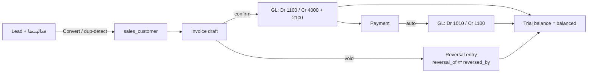

# Phase 26.23 — GL Integration Core + Operational CRM

## جدول بندها و وضعیت

| بند | شرح | وضعیت |
|---|---|---|
| ۱.۱ | پست خودکار فاکتور فروش در تأیید + نگاشت پیکربندی‌پذیر + سند پرداخت فروش | ✅ |
| ۱.۲ | همان منطق برای خرید (فاکتور + پرداخت) | ✅ |
| ۱.۳ | idempotent (گارد gl_entry_id) + ابطال → سند معکوس | ✅ |
| ۱.۴ | ستون/لینک «سند حسابداری» در لیست اسناد فروش و خرید | ✅ |
| ۲.۱ | سند معکوس با ارجاع دوطرفه `reversal_of` ⇄ `reversed_by` | ✅ |
| ۲.۲ | DELETE فقط برای draft — سند void هرگز حذف فیزیکی نمی‌شود | ✅ |
| ۲.۳ | logAction کامل (before/after/IP) روی هر دو عملیات | ✅ |
| ۲.۴ | تست: معکوسِ متوازن + رد حذف سند void | ✅ (۶ تست واحد + live-PG) |
| ۳.۱ | شمارهٔ JE از موتور Numbering (فرمت seed شده `JE-{YYYY}-{seq:5}`، سالانه، بدون‌شکاف) | ✅ |
| ۳.۲ | عملیات `update` روی PUT — فقط draft، توازن مجدد، audit با diff خطوط | ✅ |
| ۳.۳ | «کپی از سند» + الگوهای سند (`gl_entry_templates`) در ادیتور ژورنال | ✅ |
| ۴.۱ | سوییچ `gl_posting_approval` + آستانه؛ maker ≠ checker در سطح سرور | ✅ |
| ۴.۲ | صف «در انتظار تأیید» در Finance + اکشن در ماژول approvals (reuse) | ✅ |
| ۴.۳ | تست: خودتأییدی رد شد؛ تأیید checker → posted | ✅ |
| ۵.۱ | `crm_activities` + CRUD کامل zod + تایم‌لاین در UI لید | ✅ |
| ۵.۲ | مالکیت (owner موجودِ `owner_id` reuse شد) + واگذاری + فیلتر «لیدهای من» | ✅ |
| ۵.۳ | Convert با تشخیص تکراری ایمیل/تلفن + `converted_customer_id` + لینک UI | ✅ |
| ۵.۴ | کانبان HTML5 DnD + سوییچ جدول/کانبان حفظ‌شونده در `table_prefs.viewMode` | ✅ |
| ۵.۵ | SLA پیگیری (`crm_sla_days` تنظیم‌پذیر، پیش‌فرض ۷) → business_alerts idempotent + شمارنده | ✅ |
| ۵.۶ | FA/EN + RTL + فقط توکن تم | ✅ |
| ۶ | گیت‌ها/گزارش/CLAUDE.md/push | ✅ |

## نگاشت حساب‌های پست خودکار (پیکربندی در erp_settings)

| کلید | پیش‌فرض | استفاده |
|---|---|---|
| `gl_map_ar` | 1100 دریافتنی | بدهکارِ فاکتور فروش · بستانکارِ دریافت مشتری |
| `gl_map_revenue` | 4000 درآمد | بستانکار فاکتور فروش (برگشت معکوس) |
| `gl_map_vat` | 2100 مالیات | بستانکار VAT فروش · بدهکار VAT خرید |
| `gl_map_ap` | 2000 پرداختنی | بستانکار فاکتور خرید · بدهکار پرداخت تأمین‌کننده |
| `gl_map_inventory` | 1200 موجودی | بدهکار فاکتور خرید |
| `gl_map_bank` | 1010 بانک | بدهکار دریافت مشتری · بستانکار پرداخت تأمین‌کننده |

پیاده‌سازی: `src/lib/erp/glPosting.ts` — `loadGlMap` + `applyGlMap` (pure) روی
خروجی موتورهای موجود `salesInvoicePostingLines`/`purchaseInvoicePostingLines`؛
`postSalesPaymentToGl`/`postPurchasePaymentToGl` (idempotent با `gl_entry_id`
روی جدول پرداخت‌ها)؛ `reverseEntry` (آینه‌ای، لینک دوطرفه، idempotent)؛
`postEntryById` (مسیر مشترک روت + هوک تأیید).

## دیاگرام چرخه

## Changelog
- **DB (idempotent)**: `gl_journal_entries.reversal_of/reversed_by` ·
  `sales_payments.gl_entry_id` · `purchase_payments.gl_entry_id` ·
  `gl_entry_templates` · `crm_activities` · `crm_leads.converted_customer_id` ·
  seed فرمت numbering `journal` + کلیدهای `gl_map_*`/`gl_posting_approval*`/
  `crm_sla_days` + قانون matrix پیش‌فرض `journal_entry`.
- **lib**: `erp/glPosting.ts` جدید؛ نگاشت در هر دو پستر؛ پرداخت خرید در
  `recordPayment` خودکار GL می‌زند؛ maker≠checker و هوک post در `approvalData`.
- **API**: journal (شماره از Numbering، `update` برای draft، void→reversal،
  DELETE فقط draft، templates، صف pendingApprovals، maker/checker در post)؛
  sales documents (confirm→auto-post با خطای صریح دورهٔ بسته، void→reversal)؛
  sales payments (auto-post)؛ CRM leads (mine/owner/SLA) + `leads/convert` +
  `crm/activities`؛ `table-prefs` با `viewMode`.
- **UI**: FinanceCenter (ویرایش draft، کپی از سند، الگوها، صف تأیید، ابطال=سند
  معکوس)؛ SalesCenter/PurchasingCenter (ستون لینک سند GL)؛ LeadsManager
  (کانبان DnD، تایم‌لاین فعالیت، تبدیل به مشتری، لیدهای من، بج SLA).

## تست‌ها و نتایج
- **واحد**: ۶ تست جدید `glPosting.test.ts` (نگاشت + معکوس متوازن + صفر شدن AR)
  → مجموع **۶۵۵** تست، همه سبز.
- **Live-PG (۲۶/۲۶)**: lead→activity→convert(dup-check)→invoice→auto-GL
  (idempotent)→دریافت مشتری (Dr بانک/Cr دریافتنی، idempotent)→فاکتور+پرداخت
  خرید→void→reversal (لینک دوطرفه، AR صفر، رد حذف)→شمارهٔ ترتیبی
  `JE-2026-00006/7`→الگو→maker/checker (خودتأییدی رد، تأیید checker → posted)→
  **تراز آزمایشی بالانس + integrity 100**.
- **رگرسیون**: شبیه‌سازی دوساله 45/45 · خودترمیمی 28/28 · کدینگ/RBAC 9/9.
- **گیت‌ها**: TS 0 · ESLint 0 · ۷ ممیزی 0 · build تمیز. Deploy بدون تغییر
  (وابستگی/env جدید ندارد؛ migration خوداجرا).
